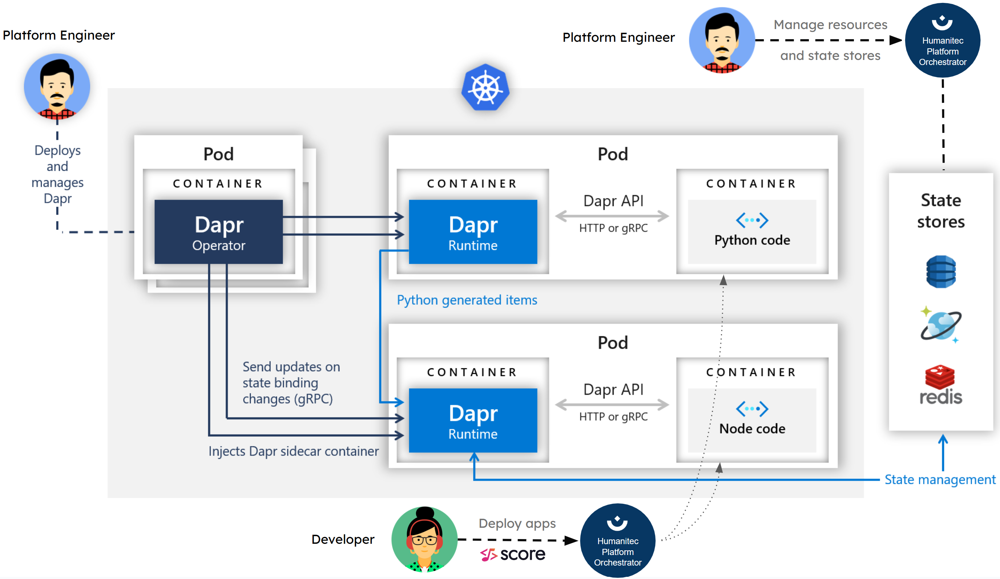

# Dapr with Score & Humanitec

Resources used in the blog post: [Dapr with Score and Humanitec — Improving the Developer Experience of your Platform, on steroids!](https://medium.com/@mabenoit/dapr-with-score-and-humanitec-developer-experience-with-your-platform-on-steroids-a848f2de0a5a).

[](https://codespaces.new/mathieu-benoit/dapr-score-humanitec)



## Deploy locally with Docker

```bash
make compose-test

docker logs hello-world-nodeapp-nodeapp-1
```

## Deploy to Kubernetes

```bash
make kind-create-cluster

make k8s-test
```

## Deploy to Humanitec

```bash
export HUMANITEC_ORG=FIXME
export HUMANITEC_APP=FIXME
export HUMANITEC_ENVIRONMENT=development

humctl login

humctl apply -f humanitec-resources/in-cluster-redis.yaml
humctl apply -f humanitec-resources/redis-dapr-state.yaml

make humanitec-deploy
```

## Resources

- https://github.com/dapr/quickstarts/blob/master/tutorials/hello-kubernetes
- https://github.com/dapr/samples/tree/master/hello-docker-compose
